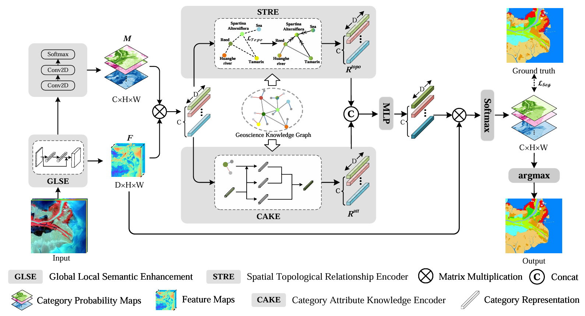

# Knowledge-driven Category Representation Learning for Remote Sensing Classification of Coastal Wetlands

## Abstract

Fine-grained classification of coastal wetlands from remote sensing images is a challenging task due to the spectral overlap between different wetland vegetation types, making them difficult to distinguish. Traditional methods for remote sensing interpretation often rely on manual classification or shallow machine learning approaches, which fail to effectively capture complex spatial relationships and contextual information. To integrate ecological and biological prior knowledge and enhance the generalization performance of the model, this paper proposes a remote sensing image classification method for coastal wetlands based on Category Representation Learning, called CRLNet. The core idea is to learn category-invariant representations of land cover types in coastal wetlands using geoscience knowledge graphs and deep neural networks. First, deep feature maps and classification probability maps generated by a semantic segmentation network are used to initialize the representations of each category; then, the Spatial Topological Relationship Encoder (STRE) and Category Attribute Knowledge Encoder (CAKE) are proposed, employing a two-stream architecture to refine the representations of each category; finally, each pixel is assigned to the category with the highest similarity based on the aforementioned deep feature maps and category-invariant representations. By combining graph convolution and self-attention mechanisms, CRLNet effectively integrates ecological and biological prior knowledge into category representation learning, thereby reducing the likelihood of conflicts between classification results and geoscience prior knowledge. Experimental results demonstrate that CRLNet outperforms state-of-the-art methods on the Huanghe River and Yancheng coastal wetland datasets. Notably, CRLNet is a lightweight framework with only $ \frac{1}{55} $ of the parameter count of CGGLNet, making it computationally efficient while maintaining high classification accuracy.

